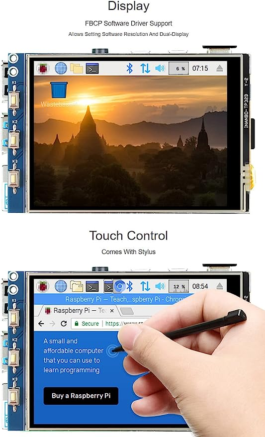

# Raspberry pi 3.2inch TFT display

Many times, I've tried to configure my display on a `Raspberry 3b`. Fortunatly, I've found the correct answer of how to do that.

In This repo you can see what I've used to make it works.
The drive of my screen is: `ILI9341`

[](https://www.amazon.com.br/waveshare-Raspberry-Resistive-Raspbian-Provided/dp/B01HPV68UM)

`Note: Mine is not the waveshare version`

## 1. Install driver

First of all you need to install the drivers.
You can use the driver directly, which you can find [here](https://github.com/juj/fbcp-ili9341). But, a simpler way is to use [this script](https://github.com/goodtft/LCD-show/tree/master).

Just choose one, and follow the tutorial.

## 2. Fixing screen fps

After that, I've changed some configs at `/boot/config.txt`, to make smoother experience.

I changed the following lines:
```
dtoverlay=tft9341:rotate=270

and 

hdmi_cvt 480 360 60 6 0 0 0
```

to 


```
dtoverlay=tft9341:rotate=270,fps=40,speed=42000000

and 

hdmi_cvt 480 360 60 1 0 0 0
```

You can see the whole file [here](./config.txt)

## More info

If you want more information, checks these videos:

[](https://youtu.be/cQvC-UI2vQY)

[](https://youtu.be/Fj3wq98pd20)

[](https://youtu.be/uz4sa24C4gk)

# NOW, JUST ENJOY :)
